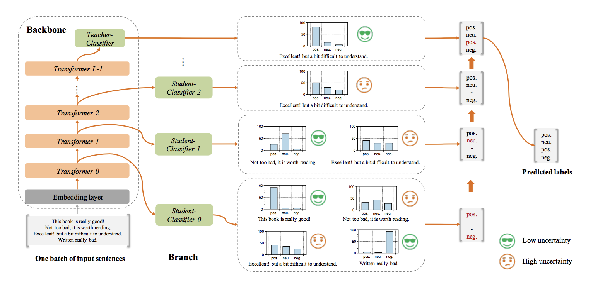
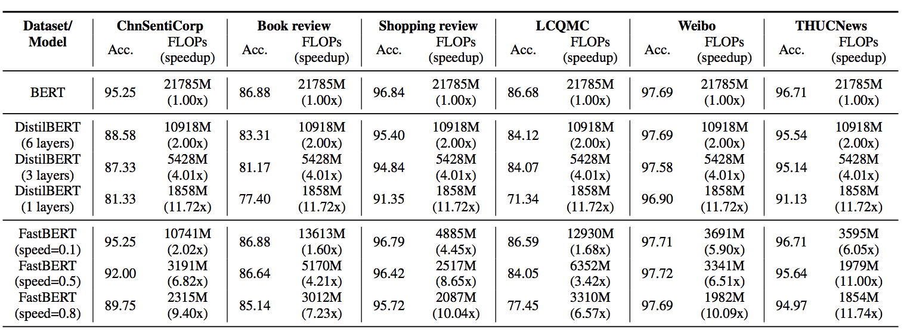

### FastBert,  复现ACL2020论文 [FastBERT: a Self-distilling BERT with Adaptive Inference Time](https://arxiv.org/pdf/2004.02178.pdf)

### 简介
    1. 相比一众BERT蒸馏方法，FastBERT准确率损失较小, 加速比约1~10倍
    2. 适用于文本分类任务，想要用BERT提升效果但受限于机器资源的场景
    3. 和BERT预训练模型兼容，可灵活替换各种预训练模型，如ernie

### 使用方法
```bash
    1. 初始训练:
    sh run_scripts/script_train_stage0.sh
    
    2. 蒸馏训练:
    sh run_scripts/script_train_stage1.sh
    **注意** :蒸馏阶段输入数据为无监督数据，可依据需要引入更多数据提升鲁棒性

    3. 推理:
    sh run_scripts/script_infer.sh
    其中 inference_speed参数(0.0~1.0)控制加速程度
    
    4. 部署使用
    python3 predict.py
```
 
```bash   
若想替换为ernie模型，只需要把 
--model_config_file='config/fastbert_cls.json'
替换为
--model_config_file='config/fastbert_cls_ernie.json'
```

### 模型思路
##### 加速思路
    1. 每一层transformer都接一个子分类器
    2. 根据样本输入，自适应12层transformer的推理深度，子分类器置信度高则提前返回
##### 训练思路
    1. load 预训练好的bert
    2. 跟普通训练一样finetune模型
    3. freeze主干网络和最后层的teacher分类器，每层的子模型拟合teacher分类器（KL散度为loss）
    4. inference阶段，根据样本输入，子分类器置信度高则提前返回
    


### 结果对比
##### 论文结果:


##### 实测结果:
```bash
ChnSentiCorp:
speed_arg:0.0, time_per_record:0.14725032741416672, acc:0.9400,   基准
speed_arg:0.1, time_per_record:0.10302954971909761, acc:0.9420,   1.42倍
speed_arg:0.5, time_per_record:0.03420266199111938, acc:0.9340,   4.29倍
speed_arg:0.8, time_per_record:0.019530397139952513, acc:0.9160,  7.54倍
注:speed=0.1的情况下比基准的准确率还高，是有可能的，正则之类的效应
```

1. 对于实际场景任务中，测试了语义理解要求较高的模型，经测试在加速1~6倍时，精度和原始BERT差距很小
2. 对于稀疏场景模型，线上正例占比很小，则可进一步提高加速比, 某模型负例约17%走到第12层，正例约81%走到第12层


